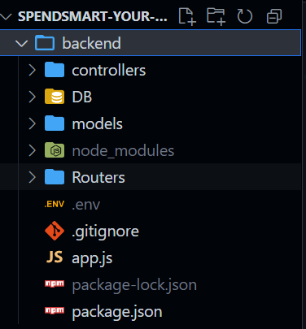
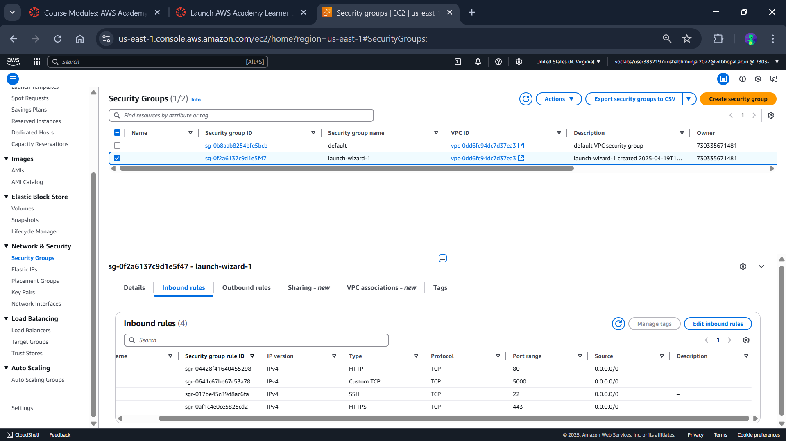
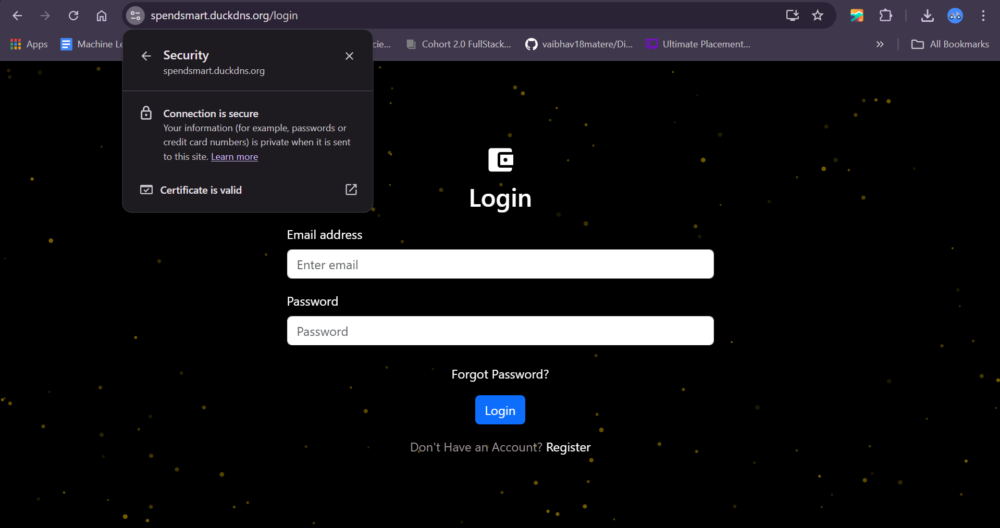

# 🚀 From Localhost to Live: How I Deployed My MERN App on AWS with HTTPS and a Custom Domain

## 👋 Introduction

Hey there, fellow dev! 👨‍💻👩‍💻

Have you ever built a cool project and wished you could show it off to the world, but the thought of deploying to the cloud and setting up HTTPS made you pause? Yep, I’ve been there.

Recently, I deployed  full-stack personal finance tracker — **Spendsmart** — on an AWS EC2 instance, complete with HTTPS and a custom domain. And guess what? I didn’t pay a single rupee for the domain or SSL certificate! 💸

This blog isn’t just a technical walkthrough — it’s my journey, roadblocks and all. Whether you're deploying your first MERN app or just want a better way to do it, I hope this helps you.

---

## 🧱 Project Stack Breakdown

Let’s first talk about what’s under the hood of this app:

- **Frontend**: Built with React, using `npm run build` to generate static assets for deployment.
- **Backend**: Node.js + Express API handling requests and talking to the database.
- **Database**: Currently MongoDB running locally on the server (moving to a cloud DB soon!).
- **Hosting**: AWS EC2 (Ubuntu 20.04 LTS) — using the free tier through the AWS Academy Learner Lab.
- **Web Server**: Nginx acting as a reverse proxy to serve the React app and route API calls.
- **Domain**: [DuckDNS](https://www.duckdns.org/) — a free dynamic DNS service (bless them 🙏).
- **SSL/HTTPS**: Let’s Encrypt via Certbot, offering free, automated SSL certificates.

> **📝 Note**: Since I used the AWS Academy Learner Lab, which comes with a $50 budget, your mileage may vary. The EC2 instance shuts down once the lab session ends, so the link below may not always work.

---

## 📦 Step 1: Prepping the Backend

Before we even talk about the cloud, I made sure my Express server was running well locally.

✅ CORS enabled  
✅ `.env` file secured  
✅ Port `5000` ready for API traffic  
✅ Verified everything with Postman  

```bash
node index.js
# or
npm start
```

Here’s a quick peek at my folder structure :  


---

## 🖥️ Step 2: Spinning Up AWS EC2

AWS EC2 gives you scalable compute power in the cloud. I launched a t2.small instance (t2.micro was crashing).

**Steps I followed:**

- Selected Ubuntu 20.04 LTS
- Opened required ports:
  - `22` for SSH
  - `80` for HTTP
  - `443` for HTTPS
  - (Optional: `5000` for testing backend directly)
  
```bash
ssh -i <your-key.pem> ubuntu@<your-ec2-ip>
```




---

## 🌐 Step 3: NGINX to the Rescue

NGINX acts like the traffic cop of the web — it handles HTTP requests and decides whether to serve static files or forward them to your backend.

### Installed NGINX

```bash
sudo apt update
sudo apt install nginx
```

### Configured Default Site

```bash
sudo nano /etc/nginx/sites-available/default
```

Here’s the key config section:

```nginx
server {
    listen 80;
    server_name spendsmart.duckdns.org;

    root /home/ubuntu/personal-finance-tracker/frontend/build;
    index index.html;

    location / {
        try_files $uri /index.html;
    }

    location /api/ {
        proxy_pass http://localhost:5000;
        proxy_http_version 1.1;
        proxy_set_header Upgrade $http_upgrade;
        proxy_set_header Connection 'upgrade';
        proxy_set_header Host $host;
        proxy_cache_bypass $http_upgrade;
    }
}
```

```bash
sudo systemctl restart nginx
```


---

## 🌍 Step 4: Free Domain with DuckDNS

Why pay for a domain when DuckDNS exists?

- Signed up at [DuckDNS](https://www.duckdns.org/)
- Created subdomain: `spendsmart.duckdns.org`
- Linked it to EC2’s public IP
- Set up cron to auto-update IP every 5 mins (since EC2 IPs can change)

```bash
crontab -e
```

```cron
*/5 * * * * curl "https://www.duckdns.org/update?domains=spendsmart&token=<your-token>&ip="
```


---

## 🔐 Step 5: Adding HTTPS with Certbot + Let’s Encrypt

Let’s Encrypt gives you free SSL certificates (and they’re legit!) 🔐

### Installed Certbot

```bash
sudo apt install certbot python3-certbot-nginx
```

### Generated SSL Cert

```bash
sudo certbot --nginx -d spendsmart.duckdns.org
```

### Checked Renewal

```bash
sudo certbot renew --dry-run
```

Boom — HTTPS enabled!



---

## 🧪 Step 6: Real-World Debugging

Some issues I hit and how I fixed them:

- ❌ *NGINX not starting*:  
  `sudo nginx -t` to validate config syntax

- ❌ *Backend not reachable*:  
  Used `lsof -i -P -n | grep LISTEN` to see if port 5000 was open

- ❌ *SSL not working*:  
  Checked firewall and opened port `443`

- ❌ *Frontend 404s*:  
  Had to serve `index.html` for React Router in NGINX config

These hiccups taught me more than any tutorial. Deploying is where the real learning happens!

---

## ✅ Final Result

You can check the app here:  
👉 **[https://spendsmart.duckdns.org](https://spendsmart.duckdns.org)**  
> _(May not work if my AWS Learner Lab is shut down — feel free to ping me for a live demo!)_

https://drive.google.com/file/d/12mv7x9RYj3RDMzC37azPxz_jUVjrHNVI/view?usp=sharing

---

## 💡 What I Gained from This

This wasn’t just about putting code on a server — it was about **becoming a full-stack engineer** who can:

- Handle server setups
- Configure secure deployments
- Debug tricky hosting issues
- Use free resources smartly

---

## 🛣️ What’s Next?

- 🛠 Migrate MongoDB to the cloud (DynamoDB)
- 🔄 Set up CI/CD with GitHub Actions for smoother deployments
- 📊 Add monitoring using UptimeRobot or Prometheus

---

## 🙌 Final Words

This journey was intense but incredibly rewarding. I feel way more confident shipping projects now — and this is just the start.

If you’re thinking about deploying your app, go for it. Don’t wait for the “perfect setup.” You’ll learn so much from the bumps on the road.

Feel free to connect, ask questions, or share your deployment story with me! 🚀

Thanks for reading, and happy shipping! ✨

---